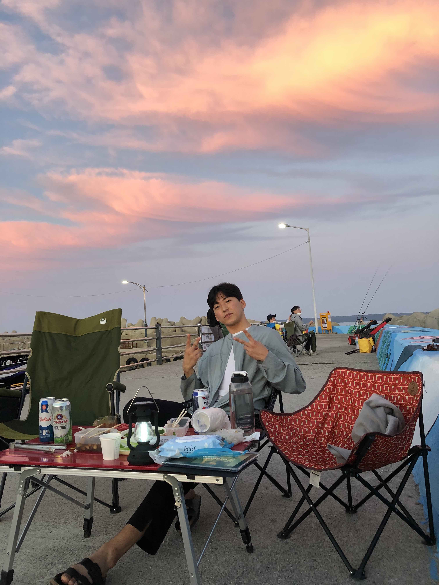

## namoojoon.github.io 블로그

-  배운 것을 기록하는 공간
-  Handong Global University 재학중
-  Github ID: NaMooJoon
	>  https://github.com/NaMooJoon
  

> ### 내가 좋아하는 명언
	지금 완료하자. 지금 하지 않는 일을 계속해서 생각하고 자책하며 오는 불안이 실제로  
	그 일을 하는 것보다 더 힘들고 시간을 많이 잡아먹을 때가 많다.
