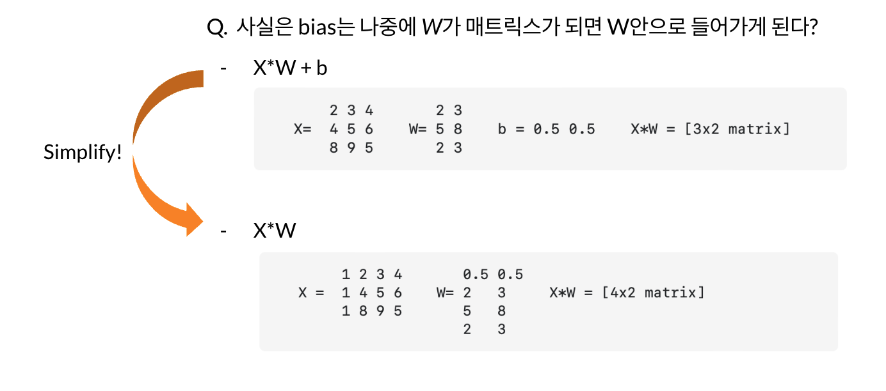
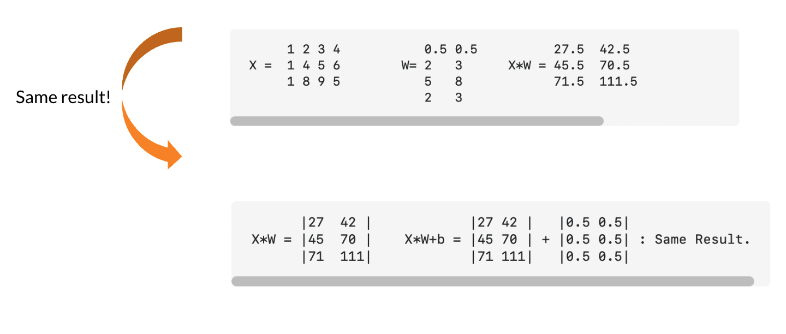
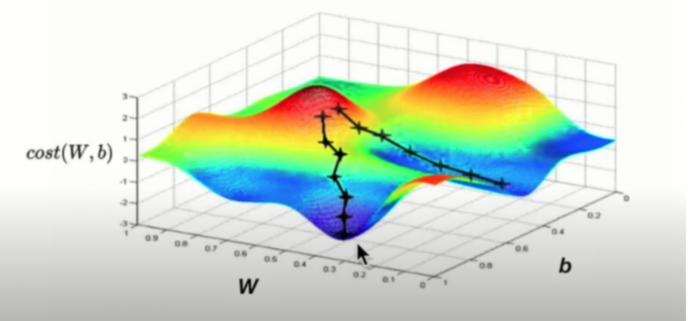
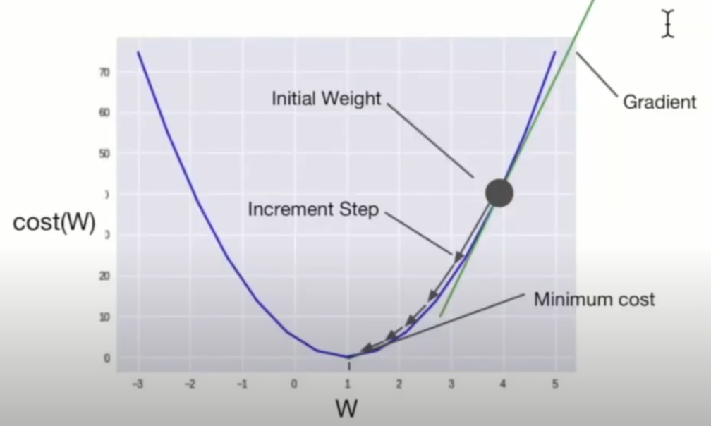
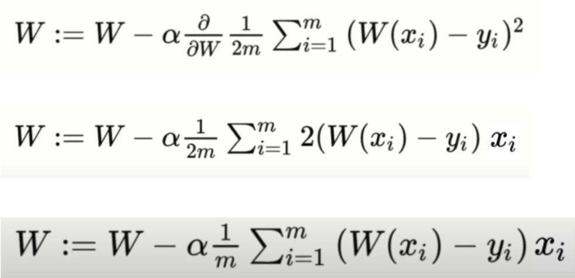

# How to minimize the cost?

> 참조 사이트
> https://deeplearningzerotoall.github.io/season2/   
> https://deeplearningzerotoall.github.io/season2/lec_tensorflow.html 
>

**순서**

- Simplifed hypothesis에 대하여
- $cost(W)$는 어떻게 생겼을까?
- Gradient descent algorithm
- Convex function

---

## Hypothesis

| Hypothesis | $H(x) = Wx + b$                                         |
| ---------- | ------------------------------------------------------- |
| **Cost**   | $cost(W,b) = {1\over m} \sum_{i=1}^{m}(H(x_i) - y_i)^2$ |

## Simplified hypothesis

| Hypothesis | $H(x) = Wx$                                         |
| ---------- | --------------------------------------------------- |
| **Cost**   | $cost(W) = {1\over m} \sum_{i=1}^{m}(Wx_i - y_i)^2$ |

비용을 최소화 하는 알고리즘에 관하여

$cost(W,b) = {1\over m} \sum_{i=1}^{m}(H(x_i) - y_i)^2$

cost함수는 우리의 가설, 우리의 예측과 실제 데이터의 차이 (error) 제곱의 평균을 우린 비용함수로 정의를 하였다. 계산을 쉽게 하기위해서 우리는 Hypothesis 함수를 간략하게 $H(x) = Wx$로 둔다.

$cost(W) = {1\over m} \sum_{i=1}^{m}(Wx_i - y_i)^2$	

​					

**계산을 쉽게** 하기위해서 계산을 간략하게 만든 것.
bias가 생략이 되어 있는 데, 사실은 **bias**는 나중에 W가 매트릭스가 되면 **W 안에 포함**되게 된다.
따라서 bias가 생략된 것은 아니다.

> 
>
> 
>
> 

---

지금까지 우리는 $cost(W) = {1\over m} \sum_{i=1}^{m}(Wx_i - y_i)^2$ 를 도출 해냈다  
## 그렇다면 cost(W)는 어떻게 생겼을까?

$cost(W) = {1\over m} \sum_{i=1}^{m}(Wx_i - y_i)^2$

W를 변화 시키면서 cost 모양을 살펴 보자.

  

W값에 각각 {0, 1, 2, 3}을 대입하면 다음과 같이 값을 도출 할 수 있다.  
이를 그래프에 포인트로 찍어보면 다음과 같다.

이를 바탕으로 cost(W)를 컴퓨터로 좀 더 조밀하게 그래프를 그려 보면 다음과 같이 결과를 얻을 수 있다.

이전 강의에서 <u>머신 러닝이란 cost를 최저점으로 만드는 W를 찾아가는 과정</u>이라고 소개한 적 있다. 따라서 우리의 목표는 cost가 가장 작게 되는 W를 구하는 것이다. 사람 입장에서 그래프를 눈으로 본다면 굉장히 쉽게 찾을 수 있다(이차원 그래프에서 가장 아래부분을 가리키는 값이다.). 하지만 컴퓨터는 그렇지 않다. 컴퓨터는 어디가 최저점인 지 분별할 수 없기 때문에 최저점을 기계적으로 알고리즘적으로 찾는 방법이 필요하다.

그 중에 널리 알려진 방법이 ***Gradient decent algorithm***이다. 우리말로 하면 경사하강알고리즘이라고 하는 데, 경사를 따라 내려가면서 <u>최저점을 찾도록 설계된 알고리즘</u>이다. 

엔지니어링 문제의 대부분은 최적화 문제이고, 최적화 문제는 이득을 최대화 시키거나 손실을 최소화 시키는 방법을 찾는 것이다.

## Gradient descent algorithm(경사 하강 알고리즘)

이 알고리즘은 변수가 한 두개 뿐만 아니라, 여러개 일때도 사용할 수 있는 굉장히 좋은 알고리즘이다. $Cost(w_1,w_2,w_3,...)$

기본 개념은 함수의 기울기(경사: Gradient)를 구하고 경사의 반대 방향으로 이동시켜 극값(기울기가 0인 값)에 극한으로 가까이 이를 때 까지 이를 반복시키는 것이다.

경사를 따라 내려가면서, 최저점을 찾도록 만들어진 알고리즘. 최적화(손실을 최소화하는 과정)

### Algorithm

$$
\begin{aligned}
Repeat\space until\space convergence\space to\space 0 \space \{\\
	W := W-\alpha\displaystyle \frac{\partial}{\partial w}\frac{1}{2m}\sum_{i=1}^{m}(W(x_i)-y_i)^2\\
\}
\end{aligned}
$$

Gradient descent algorithm은 비교적 간단하다. Cost함수의 미분을 구한다음 그 미분값에 learning rate 값을 곱한 값 만큼 W에 빼주어 기울기 값을 조정하는 것이다. 그래프로 나타내면 다음과 같다.

위의 이차함수는 Cost function이다. 위와 같이 해당되는 W값에서 gradient(기울기)를 알아낸 다음 그 만큼 W값을 조정함으로써 W의 기울기가 0으로 수렴할 수 있도록 이 과정을 반복한다.

Parameter인 $W$값을 조정하는 식의 미분은 다음과 같다.

하지만 Gradient descent algorithm의 한계도 분명이 존재한다.
이는 local minimum또한 최저점으로 판단한다는 문제이다.

우리가 위에서 봤던 이 그래프를 자세히 보면, local-mimimum(즉 기울기가 0이 되는 부분)이 여러군 데 위치하고 있다는 것을 알 수 있다. Gradient descent algorithm은 local-minimum에 갖힌 경우 벗어나기 어렵다는 한계점이 있다. 그래서 우리는 ***Convex function***에서만 gradient descent algorithm을 사용하는 것이 바람직하다.

> 생각해볼 거리
>
> - learning rate가 만일 크다면?
> - Convex 함수는 어떻게 알아낼 수 있나?

