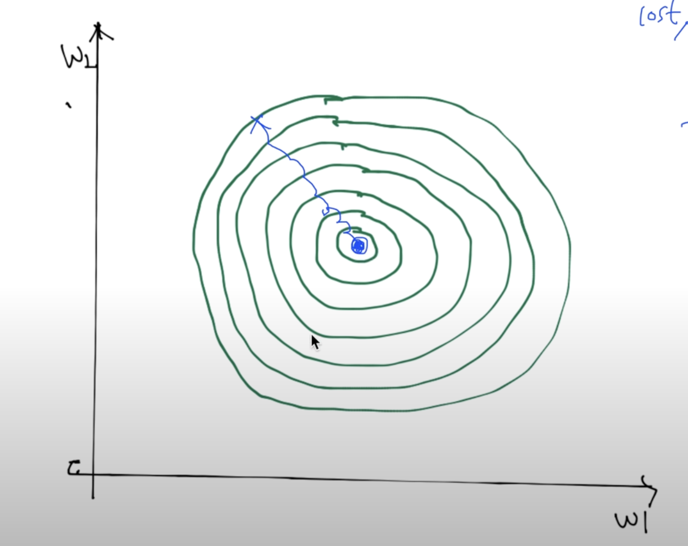
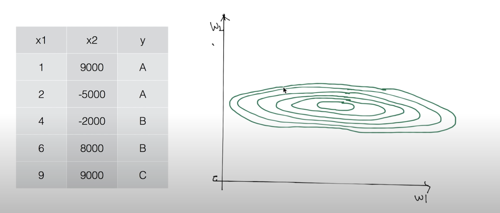
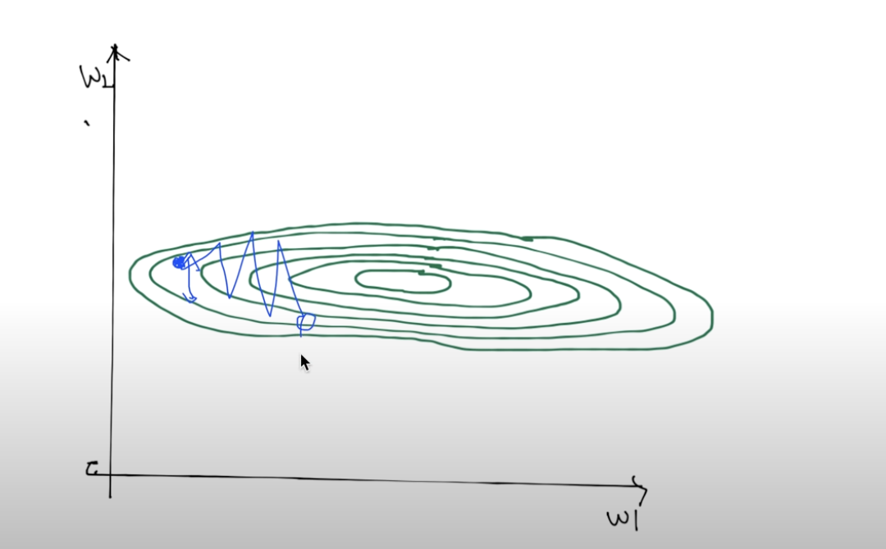
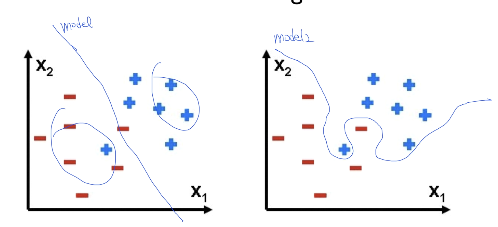
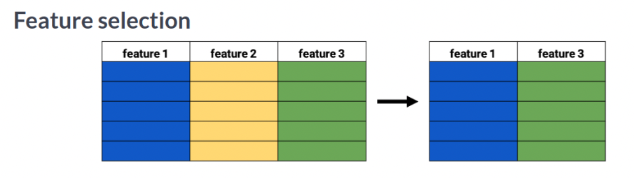
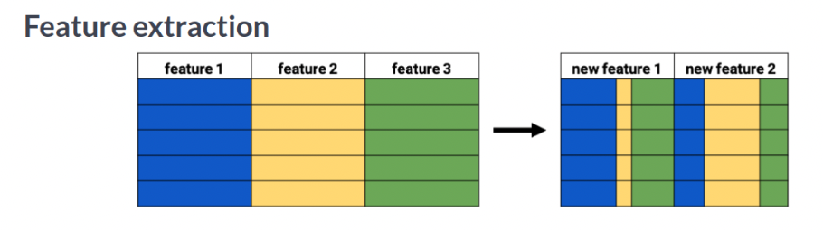

> 참조 사이트  
> https://deeplearningzerotoall.github.io/season2/   
> https://deeplearningzerotoall.github.io/season2/lec_tensorflow.html 

## Learning Rate

우리가 Gradient descent를 배웠을 때, cost function의 derivative를 $\alpha$값에 곱하는 과정을 진행했었다. 이 $\alpha$를 우리는 **learning rate**라고 부르는데, 우리는 learning rate를 잘 구하는 것이 중요하다. 만일 learning rate를 너무 크게 잡으면 발산하거나, 아니면 정확하지 않은 범위에서 멈추게 된다. cost 값이 줄어들지 않고 발산하는 것을 우리는 ***over shooting***이라고 부른다.

만일, learning rate를 너무 작게 잡는다면 어떻게 될까? 이런 경우에는 학습의 속도가 너무나 늦어진다. 그래서 어느 순간 학습을 중단 하여 cost를 확인하면 최저점에 이르지 못한 상태로 끝날 것이다.

따라서 우리는 learning rate을 적절한 값으로 입력을 해 줄 필요가 있는 데, 사실 learning rate를 정하는 정답은 없다. 학습 데이터의 환경에 따라 많이 달라지기 때문이다. 보통 0.01로 learning rate를 시작하여, 이것이 발산이 된다면 조금 더 작게, 너무 늦게 움직이면 조금 더 크게 잡는 것이 방법이다.

## 왜 Preprocessing이 필요할까?

Gradient descent의 목표는 알맞게 W를 조정하여 cost를 최소화 시키는 것이다. 이를 그래프로 그리면 다음과 같이 표현할 수 있다.

"

이상적인 $Cost$의 함수는 왼쪽과 같은 함수이다. 이를 위에서 바라보게 된다면 오른쪽과 같은 그래프로 표현 할 수 있다.

그런데 만일 input값인 x1과 x2의 값의 범위(**scale**) 차이가 크게 차이가 난다면? 

그래프는 다음과 같이 굉장히 길쭉한 모양으로 나타나게 될 것이다. 

이런 경우에는 learning rate값을 적절하게 넣어주었음에도 불구하고 저런 식으로 $w_2$에 대해서는 cost값이 이탈하는 것을 확인할 수 있다. 그래서 이렇게 데이터 값에 큰 scale 차이가 있다면 우리는 데이터에 대해서  ***generalization***을 해주어야 한다.  

## Data Preprocessing

가장 많이 쓰이는 Preprocessing인 Normalization(정규화)와 Standardization(표준화)의 차이는 무엇일까?

* ### Normalization
  한 값의 범위에 대해서 가장 큰 값은 1로, 가장 작은 값은 0으로 변환하는 것이다. 이 공식을 모든 특성들에 적용하면 모든 특성이 [0, 1]의 범위를 갖게 된다. 

  $X'=\frac{X-X_{min}}{X_{max}-X_{min}}$

* ### Standardization
  표준화는 어떤 특성의 값들이 정규분포를 따른다고 가정하고 값들을 0의 평균, 1의 표준편차를 갖도록 변환해주는 것이다.   Standardization을 하면 Normalization처럼 특성의 값 범위가 0과 1의 범위로 균일하게 바뀌지는 않는다.

  $X'=\frac{X-\mu}{\sigma}$

Data를 가공화 한 모습은 다음과 같다.

<cite><a href = "https://www.analyticsvidhya.com/blog/2020/04/feature-scaling-machine-learning-normalization-standardization/">Analytics Vidhya, "Feature Scaling for Machine Learning: Understanding the Difference Between Normalization vs. Standardization"</a></cite>

## Overfitting

Overfitting은 우리가 만든 모델이 training data set에만 너무 잘 맞도록 설계된 것이다. 이는 test data set에는 fit하지 않을 것이다.

이러한 overfitting 상황은 train data에만 큰 예측률을 보이고, 나머지 다른 상황에 대해서는 잘 맞지 않기 때문에 모델을 좀 더 일반화 시켜야 한다. 강의에서 모델을 일반화 시킬 수 있는 방법에 대해서 다음 세가지를 소개한다.

**[Solutions for overfitting]**

- More training data!
- Reduce the number of features
- Regularization

첫번째 "More training data!"은 데이터가 많다면 일반화가 잘 된다는 것으로 통계학적으로 쉽게 받아 들일 수 있을 것이다.  
따라서 밑에 두가지 방법에 대해서 좀 더 알아보자.

### The number of features

내가 가지고 있는 데이터가 아주 많다고 하더라도, 그 데이터가 모두 훌륭한 모델을 만드는 데 필요한 것은 아니다. 데이터를 모두 결과를 도출하는 데 사용하면 정확해 질 것 같지만 오히려 결과를 잘못 도출하는 경우가 많다. 이를 통계분석적인 측면에서 얘기를 하자면, 선형 함수의 독립 변수가 많다고 해서 종속변수의 기대값이 정확도가 무조건 올라가지 않는 이유이다.

- #### Feature selection
  
  불필요한 특징을 제거하여 간결한 특징 집합을 만드는 것이다. 여기서 말하는 불필요한 특징은 일차적으로  중복이 되는 특징이라든지, 아니면 transitive한 관계를 가진 특징을 말하기도 하고, 아니면 결과 예측에 상관 관계가 낮은 특징등을 말한다.

- #### Feature extraction

  

  기존에 특징들을 조합하여 새로운 특징을 생성하는 것이다. 이렇게 하면 고차원인 feature 공간을 저차원의 새로운 feature 공간으로 투영시킨다. 가장 대표적인 알고리즘이 PCA(Principle Component Analysis)가 있다.

  <cite>https://goodboychan.github.io/python/datacamp/machine_learning/2020/07/09/01-Feature-extraction.html</cite>

정리하면 feature extraction과 feature selection 모두 고차원인 학습 모델을 저 차원으로 변환시켜 줌으로써 모델을 좀 더  단순화 해줄 수 있다.

  

<cite>https://www.researchgate.net/figure/Difference-between-feature-extraction-and-feature-selection_fig1_339209170</cite>

### Regularization

일반화는 모델을 만드는 요소인 weight을 너무 큰 값을 갖지 못하도록 하자는 것이다. overfitting이 발생하는 이유 자체가 training data set에 맞게 모델을 구부리기 때문이다. 이걸 구부리지 말고 좀 피자는 의미이다. 피자는 의미는 weight을 좀 작은 값을 갖도록 만들자는 것이다. 

> $Loss = \frac{1}{N}\sum D(S(wx_i+b), L_i) + \lambda \sum w^2$   

 

원래 Cost function에 $\lambda \sum w^2$을 추가적으로 넣어주게 됌으로써 weight의 값의 크기도 cost function에 반영되도록 만든 것이다. $\lambda$는 ***regularization strength***라고 하는 데, 이 값을 0으로 두게 되면 모델의 regularization은 고려하지 않겠다는 의미가 되고, 값을 크게 잡으면 많이 신경쓰겠다는 의미가 된다.

 

> **[Normalization과 Regularization의 차이]**
>
> 이 둘은 한국말로 번역하면 둘다 '정규화'로 한국 사람으로써 직관적으로 의미가 와닿지 않을 수 있다. 데이터 처리 측면에서 알아본다면, 
>
> - Normalization은 모델에 넣어줄 데이터값의 범위를 표준화 하여 compact하게 만들어주는 것이다. 즉 데이터를 scaling하는 데 사용되는 것이다. 
> - 이에 반해 Regularization은 training set에만 너무 overfitting 되어 있는 모델의 complexitiy를 조금 낮추어 좀 더 일반화하도록 만드는 것이다.
>
> 기능적인 측면에서 둘이 다른 일을 수행하는 것은 알기 쉬울 것이다. 하지만 아직 의미적인 부분에서 왜 저렇게 명칭이 부여 되었는 지는 아직 의문이다.
>
> 이에 대해서 좀 더 사전적인 의미를 살펴보자.
>
> - **Normal** means that which conforms to the norm
>
>   > Cats with four legs are normal, because the majority of cats have four legs.
>
> - **Regular** has more to do with frequency of occurrence.
>
>   > He drinks his regular morning coffee.
>
> Normal과 Regular은 둘다 일반적인 어떤 특정 무언가를 수식하는 말이지만, 실제 쓰임은 약간 다르다는 것을 알 수 있다.
>
> 즉 정리하자면, Normalization은 서로 scale이 다른 데이터들을 scale을 [0,1]의 데이터 형태(정해진 norm)로 **일반화**하는 과정을 말하고,
>
> Regularization은 이미 학습된 모델이 특정 사건에만 적용되는 것이 아니라, 좀 더 많은 사건들에 대해서도 잘 들어맞도록 **일반화**하는 과정을 말한다.

---

## Learning and test data set

우리가 가지고 있는 data set을 가지고 30%로 짤라서 이를 test set이라고 하고, 70%를 training set으로 둔다. training set을 가지고 학습을 시킨 다음, test set을 가지고 제대로 작동하는 지 확인. 

### Online learning

우리가 데이터 셋이 너무 많은 경우에, 우리가 한번에 다 넣어서 학습을 시키기에 너무 힘들 때가 있기 때문에, online learning이라는 학습 방법이 있다. 예를 들어서 training set이 100만개가 있다고 했을 때, 이를 한번에 컴퓨터에 올리기는 힘드니까, 이를 10만개씩 잘라서 학습을 시키는 것이다. 그러면 총 10번으로 나누어 학습을 시키는 형태가 되는 데, 이때 우리 모델이 해야하는 일은 첫번째 학습 시킨 결과가 모델에 적용 되어 있어야 한다. 

이것은 매우 좋은 모델인 이유는, 세월이 지나 새로운 데이터 10만개가 추가적으로 생겼다고 할 때, 총 110만개의 데이터를 다시 학습시키는 것이 아니라, 기존에 모델에 추가적인 10만개의 데이터를 추가로 학습시키면 되기 때문이다.

## Learning additional dataset

- ### Joint Training

  가장 기본적인 방법으로 새로운 데이터를 추가하여 처음부터 다시 학습 시키는 방법

- ### Fine Tuning

  새로운 데이터로 다시 한번 가중치를 세밀하게 조정하는 학습. 기존에 학습되어있는 모델을 그대로 사용해 추가적인 새로운 데이터를 학습시키면서 기존의 모델을 세밀하게 조정하는 방법

- ### Feature Extraction

  기존에 학습되어있는 모델의 기존 가중치는 그대로 놔두고, 새로운 레이어를 추가해서 이를 학습하는 방법

