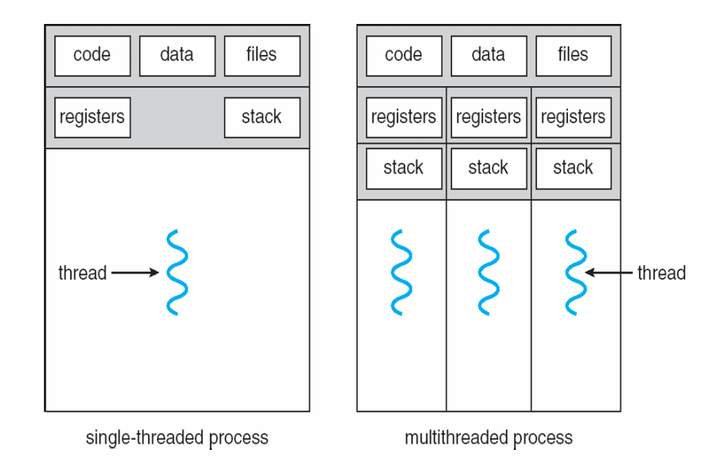

# Threads

해당 post는 내가 코딩하면서 thread를 다룰 때 기본적으로 고려해야할 개념 및 함수들에 대해서 기록하려고 한다.


## Thread란?

**Thread **란 process 내에서 실재로 작업하는 하나의 흐름 단위(unit)이라고 생각하면 된다.   process는 multi-thread를 이용해서 처리해야할 task들을 동시에 처리할 수 있다.

> Process란 단순히 실행중인 프로그램이라고 알면 된다.

Process의 생성은 많은 자원과 시간이 필요하다 (overheading). 이에 비해서 thread는 process 안에 하나의 흐름으로서, process의 주소 공간이나 자원을 공유해서 사용하기 때문에 process에 비해 생성 및 제거 비용이 작다. 또한 thread간의 전환 시간도 짧다는 장점이 있다.


<p align="center">
  
  출처: Operating System Concepts, 10th edition
</p>

위의 사진은 하나의 process안에서 thread들이 어떻게 프로그램 안에서 구성이 되는 지 보여주는 사진이다. multithread process에서 각각의 thread들은 process의 {code, data, files}를 공유하고 있는 것을 확인할 수 있다.


## Thead Control Block (TCB)

위의 사진에서 multithread process를 보면, 각각의 thread 마다 register와 stack이  따로 존재한다는 것을 알 수 있다. Stack은 함수 호출 시 전달되는 인자와 함수가 끝났을 때 돌아갈 주소값, 그리고 함수 내에서 선언하는 변수들을 저장하기 위해 사용되는 메모리 공간이다. Stack을 독립적으로 두는 이유는 thread의 독립적인 흐름을 가능하게 하기 위해서 이다. register도 마찬가지이다. 특히 PC register만 하더라도, thread가 어디 명령어까지 수행하였는 지를 알 필요가 있다. 각각의 thread가 독립적으로 실행되기 위해서는 PC register 또한 독립적으로 할당될 필요가 있다.

이처럼 하나의 thread가 운영되기 위해서 필요한 정보들을 저장되어야 하는 데, **Thread Control Block** 이라는 data structure가 이러한 기능을 제공한다.

TCB's information

- Thread ID
- State of the thread (running, ready, waiting, start, done) 
- Stack pointer
- Program Conter
- Thread's register values
- Pointer to the process control block (PCB)


## POSIX Pthreads

### API Functions

```c
/* Creates thread */
int pthread_create(pthread_t *restrict thread,
                   const pthread_attr_t *restrict attr,
                   void *(*start_routine)(void *),
                   void *restrict arg);
/* Initializes attr by default values */
int pthread_attr_init(pthread_attr_t* attr);
/* Waits for a thread th */
int pthread_join(pthread_t thread, void** thread_return);
/* Terminates thread */
void pthread_exit(void *retval);
```

해당 functions의 정의는 [man7.org](https://man7.org/linux/man-pages/man3/pthread_create.3.html)에서 확인할 수 있다.


### Example code

````c
#include <pthread.h>
#include <stdio.h>
#include <stdlib.h>

int sum = 0; /* this data is shared by the thread(s) */
void* runner(void* param); /* the thread */

int main(int argc, char* argv[])
{
	pthread_t tid = 0; /* the thread identifier*/
	pthread_attr_t attr; /* set of thread attributes */
	if (argc < 2) {
		fprintf(stderr, "usage: a.out <integer>\n");
		exit(EXIT_FAILURE);
	}
	if (atoi(argv[1]) < 0) {
		fprintf(stderr, "%d must be <= 0\n", atoi(argv[1]));
		exit(EXIT_FAILURE);
	}
	/* get the default attributes */
	pthread_attr_init(&attr);
	/* create the thread */
	pthread_create(&tid, &attr, runner, argv[1]);
	/* now wait for the thread to exit */
	pthread_join(tid, NULL);
	printf("sum = %d\n", sum);

	return 0;
}

void* runner(void *param)
{
	int upper = atoi(param);
	int i = 0;
	sum = 0;
	if (upper > 0) {
		for (i = 1; i <= upper; i++)
			sum += i;
	}
	pthread_exit(0);
}
````


## Thread-Local Storage (TLS)

모든 thread는 하나의 process안에 있는 global variables를 공유한다. 하지만, 가끔 thread가 독립적으로 사용해야하는 변수가 필요할 때가 있다. 이러한 기능을 제공해 주는 것이 **TLS**이다. 사용 방법은 `__thread int value;`로 선언하면 된다.

### Example code

```c
#include <stdio.h>
#include <stdlib.h>
#include <pthread.h>
#include <unistd.h>

#define THREADS	3

__thread int tls;
int global;

void* func(void *arg)
{
	//int num = *((int*)arg);
	int num = (int) arg;
	tls = num;
	global = num;
	sleep(1);
	printf("Thread = %d tls = %d global = %d\n",
			num, tls, global);
}

int main()
{
	int ret;
	pthread_t thread[THREADS];
	int num;

	for (num = 0; num < THREADS; num++) {
		ret = pthread_create(&thread[num], NULL, &func,
							(void*)num);
		if (ret) {
			fprintf(stderr, "error pthread_create\n");
			exit(EXIT_FAILURE);
		}
	}

	for (num = 0; num < THREADS; num++) {
		ret = pthread_join(thread[num], NULL);
		if (ret) {
			fprintf(stderr, "error pthread_join\n");
			exit(EXIT_FAILURE);
		}
	}


	return 0;
}
```